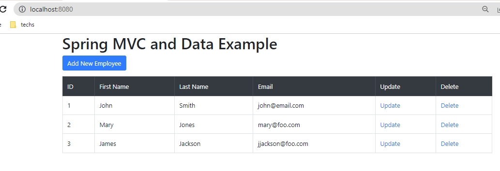

# Spring MVC and Data Example
Example of using Spring MVC, Data, and Swagger

This program is a sample of using Spring Data to work with a simple table: Employee with 3 fields: last name, first name, and email, on the H2 in-memory database. 
And then have a Spring MVC WebApplication to add/change/delete entities, and also have a REST Controller to interact with it and then have it documented via Swagger tool.

I started with Spring Initializer, with 3 dependencies Spring Web, Thymeleaf, and Spring Data JPA. This is so that I can make a Spring Data table, and then expose an API

Set up application properties to use JPA spring datasource and H2.

I configured it so it the h2 console may be launched with http://localhost:8080/h2-console/ The ddl-auto property is set to create-drop so the table will be dropped and re-created every time. It is easy to change to another database and not recreate every time.

I started with the Employee Entity class, then created a JpaRepository interface which provides me basic methods for CRUD without a single line of code. 
Then I wrote a Service class to interact with this repository to provide methods to add/change/delete.

Then I wrote Spring MVC Controllers to use these methods in a web app, and add a little bootstrap styles. http://localhost:8080

Then I wrote a RestController so the Entity can be interacted with REST API.

Then I hooked up Swagger UI (springdoc-openapi-starter-webmvc-ui) so documenting and testing the API will be easy http://localhost:8080/swagger-ui/index.html

